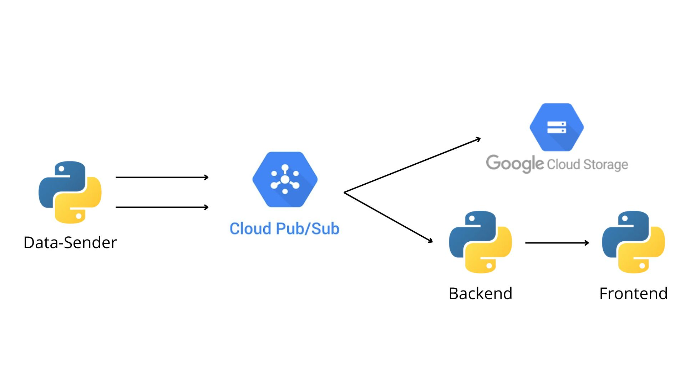

# Solar Car Cloud Project

This project simulates the data collection and visualization for a solar-powered car using a cloud-based infrastructure. It includes a backend for processing CANbus-like messages, a frontend for data visualization, and a data sender that pushes random CANbus data to Google Cloud Pub/Sub.



## Project Overview

- **Backend**: A Flask application that listens for CANbus data from Pub/Sub and provides API endpoints for the frontend.
- **Frontend**: A web interface served by Nginx to display real-time car data (voltage, temperature, engine, MPPT).
- **Data Sender**: A Python script that generates random CANbus-like messages and sends them to Pub/Sub.

## Setup and Deployment

The project is containerized using Docker and deployed on Google Kubernetes Engine (GKE). The following sections explain how to build, push, and deploy the services.

### Prerequisites

- Google Cloud SDK installed and configured
- Docker installed
- Kubernetes (`kubectl`) installed and configured to interact with your GKE cluster

### Create the GKE Cluster

To create a Google Kubernetes Engine (GKE) cluster, run the following command:

```bash
gcloud container clusters create solar-car-cluster \
--zone us-central1-a \
--num-nodes 5 \
--enable-ip-alias
```

Once the cluster is created, configure kubectl to use the credentials for the cluster

```bash
gcloud container clusters get-credentials solar-car-cluster \
--zone us-central1-a \
--project solarcaroncloud
```

### Build and Push Docker Images

To build the Docker images for the backend, frontend, and data sender, and push them to Google Container Registry (GCR), use the provided `start.sh` script.

```bash
./start.sh
```

The `start.sh` script will:

1. Build and push the Docker images for the backend, frontend, and data-sender.
2. Apply the Kubernetes deployment configurations.

Alternatively, you can manually run the following commands:

```bash
# Build and push backend
docker build -f Backend/Dockerfile -t gcr.io/solarcaroncloud/backend:latest .
docker push gcr.io/solarcaroncloud/backend:latest

# Build and push frontend
docker build -f Frontend/Dockerfile -t gcr.io/solarcaroncloud/frontend:latest .
docker push gcr.io/solarcaroncloud/frontend:latest

# Build and push data sender
docker build -f Data-Sender/Dockerfile -t gcr.io/solarcaroncloud/data-sender:latest .
docker push gcr.io/solarcaroncloud/data-sender:latest
```

## Kubernetes Deployment

To deploy the backend, frontend, and data sender services on Kubernetes, you can also use the `start.sh` script or manually apply the deployment files:

```bash
# Backend deployment
kubectl apply -f backend-deployment.yaml

# Frontend deployment
kubectl apply -f frontend-deployment.yaml

# Data Sender deployment
kubectl apply -f sender-deployment.yaml
```

## Stopping the Project

To stop the project and delete the Kubernetes deployments and cluster, use the `end.sh` script:

```bash
./end.sh
```

The `end.sh` script will:

1. Delete the Kubernetes deployments for the backend, frontend, and data sender.
2. Delete the GKE cluster.

## Cloud Function: Writing Messages to Google Cloud Storage

This project includes a Cloud Function that listens to a Pub/Sub topic and writes the messages to a Google Cloud Storage bucket. The messages are in the format `153#90B4B8CC1F9B35BA`, which consists of a 3-character hexadecimal ID followed by a `#` and 16 hexadecimal characters representing 4 bytes.

### How the Cloud Function Works

- The function is triggered by messages from a Pub/Sub topic.
- It decodes the message from the `application/octet-stream` format.
- The message is then saved to a Google Cloud Storage bucket, under a specific subdirectory (`messages/`), with each file named based on the unique event ID of the message.

### Deploying the Cloud Function

To deploy the Cloud Function, use the following `gcloud` command:

```bash
gcloud functions deploy write_to_gcs \
    --runtime python311 \
    --trigger-topic <YOUR-TOPIC> \
    --entry-point write_to_gcs \
    --region <YOUR-REGION> \
    --source .
```

where `write_to_gcs` is the name of the function.

## Running Locally

If you want to run the project locally, follow these steps:

1. Install any necessary dependencies for the backend and data sender:

    ```bash
    pip install -r requirements.txt
    ```

2. Start the backend and data sender locally:

    ```bash
    python3 backend.py
    python3 data-sender.py
    ```

You can modify the service account, project IDs, and Pub/Sub topics in the configuration files as needed.

## Notes

- Ensure that the correct service account and Google Cloud credentials are set up for your Kubernetes cluster.
- The project uses Google Cloud Pub/Sub for communication between the data sender and backend.
For more details, please refer to the project documentation.
